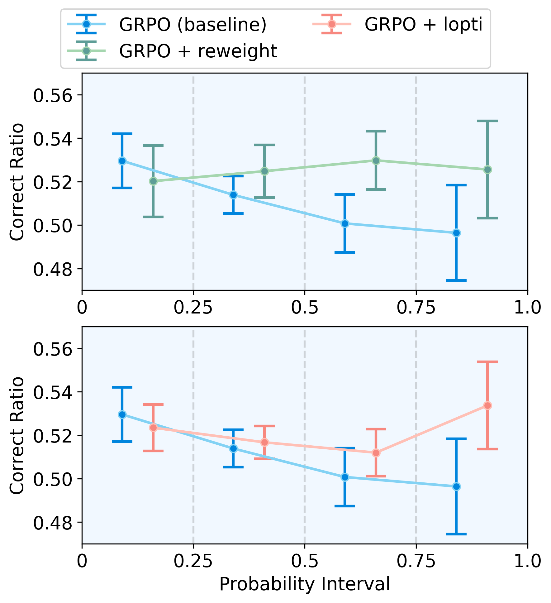
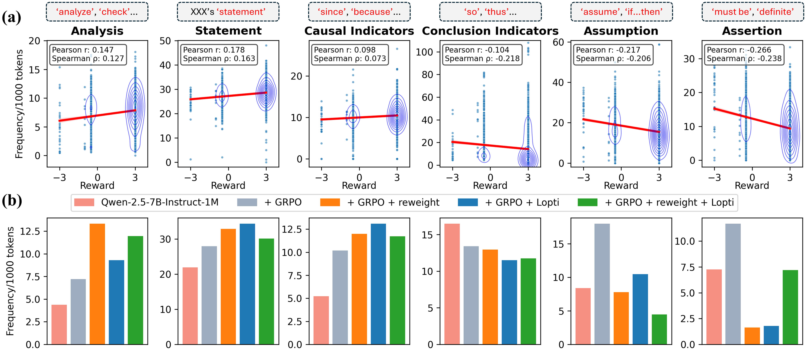

# Do Not Let Low-Probability Tokens Over-Dominate in RL for LLMs
论文地址：https://arxiv.org/abs/2505.12929
## 0. 论文核心贡献

- 指出并系统分析了一个此前几乎没人点明的偏置来源：在 GRPO 等 RL 算法下，**低概率 token 的梯度范数天然更大，会过度主导参数更新**。  
    
  上排：(a) 是 token 概率分布，(b) 是按概率四分位划分后各组的优势分布。  
  中排：(c) 在标准 GRPO 更新后，各概率分组 token 概率的变化；(d) 对应的梯度范数，低概率组的梯度显著更大。  
  下排：(e) 只更新最低 quartile 的 token，整体分布变化和 (c) 很接近；(f) 只更新最高 quartile 的 token，整体影响反而较弱。  
  ⇒ 说明 **低概率 token 的梯度在实际训练中确实主导了参数更新**。
- 在一般的“良性神经网络”假设下，严格证明了：对任意一层、任意一个 token，其梯度范数与该 token 概率之间满足 $\|\nabla\| \propto (1-\pi_\theta(o_{i,t}))$，因此，概率越低，梯度越大。
- 基于上述理论，提出两种针对 GRPO 的简单改动：
  - **Advantage Reweighting**：按 token 概率对优势函数做线性重加权，显式抑制低概率 token 的权重；
  - **Lopti（Low-Probability Token Isolation）**：把低/高概率 token 分两阶段更新，避免低概率 token 在同一 batch 内“压制”高概率 token。
- 在 K\&K Logic Puzzle 等任务上，Qwen2.5-3B/7B 等模型上实验表明：在相同训练预算下，相对原始 GRPO，**正确率可提升几十个百分点**，且回复长度更合理。

---

## 1. 问题背景：RL for LLM 与 GRPO

### 1.1 LLM 作为策略

- 模型：解码式 Transformer $\pi_\theta$，参数 $\theta\in\mathbb{R}^d$。
- 词表：$\mathcal{V}=\{v^1,\dots,v^N\}$，大小为 $N$。
- 给定 prompt $\mathbf{q}$ 和已生成 token 序列 $\mathbf{o}_{<t}$，下一个 token 采样为 $o_t \sim \pi_\theta(\cdot \mid \mathbf{q}, \mathbf{o}_{<t})$。
- 整个回复记作 $\mathbf{o}=(o_1,\dots,o_T)$。

### 1.2 RL 目标

若存在奖励函数 $r(\mathbf{q},\mathbf{o})$，则 RL 目标是最大化期望奖励：

$$
\max_{\theta} J(\theta)
  = \max_{\theta}\; \mathbb{E}_{\mathbf{q}\sim\mathcal{D},\,\mathbf{o}\sim\pi_\theta}\big[r(\mathbf{q},\mathbf{o})\big].
$$

其中 $\mathcal{D}$ 是 prompt 分布。

### 1.3 GRPO：基于 group 的 PPO 变体

GRPO 的特点：

- 每个 prompt $\mathbf{q}$ 生成 **$G$ 个候选回答** $\{\mathbf{o}_i\}_{i=1}^G$，由旧策略 $\pi_{\text{old}}$ 采样；
- 对这 $G$ 个回答做**组内归一化**得到优势 $\hat{A}_{i,t}$（这里按 token 位置 $t$ 定义优势）；
- 目标函数（简化写法，对应文中公式 (1)）：

$$
J_{\text{GRPO}}(\theta)
= \mathbb{E}_{\mathbf{q}\sim\mathcal{D},\,\{\mathbf{o}_i\}\sim\pi_{\text{old}}}
  \frac{1}{\sum_{i=1}^{G}|\mathbf{o}_i|}
  \sum_{i=1}^G\sum_{t=1}^{|\mathbf{o}_i|}
  \Big[
    \min\big(r_{i,t}(\theta)\hat{A}_{i,t},
             \text{clip}(r_{i,t}(\theta);1-\epsilon_l,1+\epsilon_h)\hat{A}_{i,t}\big)
    - \beta\,\mathbb{D}_{\mathrm{KL}}\!\big[\pi_\theta\|\pi_{\text{ref}}\big]
  \Big].
$$

- 其中

$$
r_{i,t}(\theta)
  = \frac{\pi_\theta(o_{i,t}\mid\mathbf{q},\mathbf{o}_{i,<t})}
         {\pi_{\text{old}}(o_{i,t}\mid\mathbf{q},\mathbf{o}_{i,<t})}
$$

  是 token 级别的重要性采样比率；
- KL 项 $\mathbb{D}_{\mathrm{KL}}[\pi_\theta\|\pi_{\text{ref}}]$ 用于约束策略与参考模型（通常是 SFT 模型）不要偏移太远。

---

## 2. GRPO 梯度形式：token 级权重 $w_{i,t}$

文中把 GRPO 目标的梯度写成**每个 token 的 log-prob 梯度加权和**（公式 (2)）：

$$
\nabla_\theta J_{\text{GRPO}}(\theta)
= \mathbb{E}_{\mathbf{q},\{\mathbf{o}_i\}}
  \frac{1}{\sum_i|\mathbf{o}_i|}
  \sum_{i=1}^G\sum_{t=1}^{|\mathbf{o}_i|}
  w_{i,t}\,\nabla_\theta \log\pi_\theta(o_{i,t}).
$$

下面给出证明：

### 2.1 从 GRPO 目标到 token 级梯度（把结构理清）

回顾前面写过的 GRPO 目标（对应论文中的公式 (1)）：

$$
J_{\text{GRPO}}(\theta)
= \mathbb{E}_{\mathbf{q}\sim\mathcal{D},\,\{\mathbf{o}_i\}\sim\pi_{\text{old}}}
  \frac{1}{\sum_{i=1}^G|\mathbf{o}_i|}
  \sum_{i=1}^G\sum_{t=1}^{|\mathbf{o}_i|}
  \Big\{
    \min\!\big(r_{i,t}(\theta)\,\hat{A}_{i,t},\,
               \mathrm{clip}(r_{i,t}(\theta);1-\epsilon_l,1+\epsilon_h)\,\hat{A}_{i,t}\big)
    - \beta\,D_{\mathrm{KL}}[\pi_\theta\Vert\pi_{\mathrm{ref}}]
  \Big\},
$$

其中

$$
r_{i,t}(\theta)
  = \frac{\pi_\theta(o_{i,t}\mid\mathbf{q},\mathbf{o}_{i,<t})}
         {\pi_{\text{old}}(o_{i,t}\mid\mathbf{q},\mathbf{o}_{i,<t})}
$$

是 token 级的重要性比率。

**(1) 把梯度移入期望、抽出归一化因子**

这里有三类“对象”：

- 固定的数据分布：prompt 来自 $\mathcal{D}$；
- 固定的采样策略：轨迹来自旧策略 $\pi_{\text{old}}$；
- 正在被优化的参数：$\theta$（出现在 $\pi_\theta$ 里）。

关键事实：**采样分布与 $\theta$ 无关**。  
也就是说，联合分布

$$
p(\mathbf{q},\{\mathbf{o}_i\})
= \mathcal{D}(\mathbf{q})\,
  \prod_{i=1}^G \pi_{\text{old}}(\mathbf{o}_i\mid\mathbf{q})
$$

里面没有 $\theta$。

因此 $J_{\text{GRPO}}(\theta)$ 可以写成“对 $(\mathbf{q},\{\mathbf{o}_i\})$ 做期望”的形式：

$$
J_{\text{GRPO}}(\theta)
= \mathbb{E}_{\mathbf{q},\{\mathbf{o}_i\}}
  \Big[
    f(\theta;\mathbf{q},\{\mathbf{o}_i\})
  \Big],
$$

其中

$$
f(\theta;\mathbf{q},\{\mathbf{o}_i\})
= \frac{1}{\sum_{i=1}^G|\mathbf{o}_i|}
  \sum_{i=1}^G\sum_{t=1}^{|\mathbf{o}_i|}
  \Big\{
    \min(\cdots)
    - \beta\,D_{\mathrm{KL}}[\pi_\theta\Vert\pi_{\mathrm{ref}}]
  \Big\}.
$$

因为 $p(\mathbf{q},\{\mathbf{o}_i\})$ 不依赖于 $\theta$，对 $\theta$ 求导时，它就像“常数权重”，所以我们可以安全地把梯度运算**移进期望里面**：

$$
\nabla_\theta J_{\text{GRPO}}(\theta)
= \mathbb{E}_{\mathbf{q},\{\mathbf{o}_i\}}
  \nabla_\theta
  \Big[
    f(\theta;\mathbf{q},\{\mathbf{o}_i\})
  \Big].
$$

把 $f$ 展开：

$$
\nabla_\theta J_{\text{GRPO}}(\theta)
= \mathbb{E}_{\mathbf{q},\{\mathbf{o}_i\}}
  \nabla_\theta
  \left[
    \frac{1}{\sum_i|\mathbf{o}_i|}
    \sum_{i,t} \big( \cdots \big)
  \right].
$$

这一步可以理解成：先固定一个 batch，看 “这个 batch 的 loss 对 $\theta$ 的导数”，然后再对所有 batch 做平均（期望）。

接下来，对一个**固定的 batch** 来说，$\frac{1}{\sum_i|\mathbf{o}_i|}$ 是常数，所以可以直接抽到求导外面：

$$
\nabla_\theta J_{\text{GRPO}}(\theta)
= \mathbb{E}_{\mathbf{q},\{\mathbf{o}_i\}}
  \frac{1}{\sum_i|\mathbf{o}_i|}
  \sum_{i,t}
  \nabla_\theta
  \Big\{
    \min(\cdots)
    - \beta\,D_{\mathrm{KL}}[\pi_\theta\Vert\pi_{\mathrm{ref}}]
  \Big\}.
$$

接下来只需计算每个 $(i,t)$ 的那一项的梯度。

**(2) 处理 min 与 clip：引入 $\mathbb{I}_{\mathrm{trust}}$**

对某个 $(i,t)$，记

$$
u_{i,t}(\theta) = r_{i,t}(\theta)\,\hat{A}_{i,t},\qquad
v_{i,t}(\theta) = \mathrm{clip}(r_{i,t}(\theta);1-\epsilon_l,1+\epsilon_h)\,\hat{A}_{i,t}.
$$

目标里用的是

$$
\min\big(u_{i,t}(\theta),\,v_{i,t}(\theta)\big).
$$

在每个 $(i,t)$ 上，这个 min 要么等于 $u_{i,t}$，要么等于 $v_{i,t}$。论文中把“取哪一支”编码成一个 0–1 指示函数

$$
\mathbb{I}_{\mathrm{trust}}(r_{i,t},\hat{A}_{i,t})\in\{0,1\},
$$

粗略理解为：当 $r_{i,t}$ 在可信区间内（没有被 clip 掉），并且 $u_{i,t}$ 是更小的那一项时，就令 $\mathbb{I}_{\mathrm{trust}}=1$，否则为 $0$。在这种记号下，对 $\theta$ 求导时，有

$$
\nabla_\theta \min(u_{i,t},v_{i,t})
= \hat{A}_{i,t}\,\mathbb{I}_{\mathrm{trust}}(r_{i,t},\hat{A}_{i,t})\,
   \nabla_\theta r_{i,t}(\theta),
$$

其中把被 clip 掉的那一支视为常数（对 $\theta$ 的导数为 0）。

**(3) 重要性比率的梯度：$\nabla_\theta r = r\,\nabla_\theta\log\pi_\theta$**

对同一个 token，

$$
r_{i,t}(\theta)
  = \frac{\pi_\theta(o_{i,t}\mid\mathbf{q},\mathbf{o}_{i,<t})}
         {\pi_{\text{old}}(o_{i,t}\mid\mathbf{q},\mathbf{o}_{i,<t})},
$$

分母与 $\theta$ 无关，所以

$$
\nabla_\theta r_{i,t}(\theta)
= \frac{1}{\pi_{\text{old}}(o_{i,t}\mid\cdot)}\,
   \nabla_\theta \pi_\theta(o_{i,t}\mid\cdot).
$$

同时利用恒等式 $\nabla_\theta \pi_\theta = \pi_\theta\,\nabla_\theta\log\pi_\theta$，得到

$$
\nabla_\theta r_{i,t}(\theta)
= \frac{\pi_\theta(o_{i,t}\mid\cdot)}{\pi_{\text{old}}(o_{i,t}\mid\cdot)}\,
   \nabla_\theta \log\pi_\theta(o_{i,t}\mid\cdot)
= r_{i,t}(\theta)\,\nabla_\theta \log\pi_\theta(o_{i,t}\mid\cdot).
$$

代回上一步：

$$
\nabla_\theta \min(u_{i,t},v_{i,t})
= r_{i,t}(\theta)\,\hat{A}_{i,t}\,
   \mathbb{I}_{\mathrm{trust}}(r_{i,t},\hat{A}_{i,t})\,
   \nabla_\theta \log\pi_\theta(o_{i,t}\mid\cdot).
$$

这就是 policy gradient 那一部分的系数。

**(4) KL 惩罚项的梯度：得到 $\beta\big(\tfrac{\pi_{\mathrm{ref}}}{\pi_\theta}-1\big)\nabla\log\pi_\theta$**

GRPO 中的 token 级 KL 项写成

$$
D_{\mathrm{KL}}\big[\pi_\theta\Vert\pi_{\mathrm{ref}}\big]
 = \frac{\pi_{\mathrm{ref}}(o_{i,t}\mid\cdot)}{\pi_\theta(o_{i,t}\mid\cdot)}
   - \log\frac{\pi_{\mathrm{ref}}(o_{i,t}\mid\cdot)}{\pi_\theta(o_{i,t}\mid\cdot)} - 1.
$$

为简洁起见，记

$$
x = \pi_\theta(o_{i,t}\mid\cdot),\qquad
a = \pi_{\mathrm{ref}}(o_{i,t}\mid\cdot),
$$

则

$$
f(x) = \frac{a}{x} - \log\frac{a}{x} - 1.
$$

先对 $x$ 求一阶导数：

$$
f'(x)
  = -\frac{a}{x^2} + \frac{1}{x}
  = \frac{1}{x} - \frac{a}{x^2}
  = \frac{1 - a/x}{x}.
$$

再用链式法则、以及 $\nabla_\theta x = x\,\nabla_\theta\log x$：

$$
\nabla_\theta f(x(\theta))
= f'(x)\,\nabla_\theta x
= \frac{1 - a/x}{x}\,x\,\nabla_\theta\log x
= \bigg(1 - \frac{a}{x}\bigg)\nabla_\theta\log x.
$$

也就是

$$
\nabla_\theta D_{\mathrm{KL}}\big[\pi_\theta\Vert\pi_{\mathrm{ref}}\big]
= \Big(1 - \frac{\pi_{\mathrm{ref}}(o_{i,t}\mid\cdot)}
               {\pi_\theta(o_{i,t}\mid\cdot)}\Big)
   \nabla_\theta \log\pi_\theta(o_{i,t}\mid\cdot).
$$

注意 GRPO 目标里是减去 KL：$-\beta D_{\mathrm{KL}}$，因此它的梯度是

$$
\nabla_\theta\big[-\beta D_{\mathrm{KL}}\big]
= \beta\Big(
     \frac{\pi_{\mathrm{ref}}(o_{i,t}\mid\cdot)}
          {\pi_\theta(o_{i,t}\mid\cdot)} - 1
   \Big)\nabla_\theta \log\pi_\theta(o_{i,t}\mid\cdot).
$$

**(5) 把两部分合并，得到 token 级的 $w_{i,t}$**

把 (3) 的 policy gradient 部分和 (4) 的 KL 部分加在一起，再乘上归一化系数 $\tfrac{1}{\sum_i|\mathbf{o}_i|}$，就得到

$$
\nabla_\theta J_{\text{GRPO}}(\theta)
= \mathbb{E}_{\mathbf{q},\{\mathbf{o}_i\}}
  \frac{1}{\sum_i|\mathbf{o}_i|}
  \sum_{i,t}
  \Big[
    r_{i,t}(\theta)\,\hat{A}_{i,t}\,
    \mathbb{I}_{\mathrm{trust}}(r_{i,t},\hat{A}_{i,t})
    + \beta\Big(
        \frac{\pi_{\mathrm{ref}}(o_{i,t}\mid\cdot)}
             {\pi_\theta(o_{i,t}\mid\cdot)} - 1
      \Big)
  \Big]\,
  \nabla_\theta \log\pi_\theta(o_{i,t}\mid\cdot).
$$

把中括号里的部分记作 $w_{i,t}$，便得到上面的“每个 token 的 log-prob 梯度的加权和”形式。

其中标量权重 $w_{i,t}$ 由三部分组成（重要性采样比率、优势、KL 惩罚等）：

$$
w_{i,t}
= \underbrace{
   \frac{\pi_\theta(o_{i,t})}{\pi_{\text{old}}(o_{i,t})}\,
   \hat{A}_{i,t}\,
   \mathbb{I}_{\text{trust}}\!\Big(
     \tfrac{\pi_\theta(o_{i,t})}{\pi_{\text{old}}(o_{i,t})},
     \hat{A}_{i,t}
   \Big)
 }_{\text{policy gradient 项}}
 + \underbrace{
   \beta\,\frac{\pi_{\text{ref}}(o_{i,t})}{\pi_\theta(o_{i,t})} - \beta
 }_{\text{KL 项}}.
$$

直观理解：

- 所有 token 的信息都只通过两个量进入梯度：
  1. 一个实数权重 $w_{i,t}$（告诉我们“这个 token 的贡献有多大”）；
 2. 一个方向向量 $\nabla_\theta \log\pi_\theta(o_{i,t})$（告诉我们“沿着哪个方向调参数会让该 token 的 log-prob 变大/变小”）。
- 更具体地说：
  - policy gradient 那一部分：
    $$
    \frac{\pi_\theta(o_{i,t})}{\pi_{\text{old}}(o_{i,t})}\,\hat{A}_{i,t}\,\mathbb{I}_{\text{trust}}(\cdot)
    $$
    可以看成“这个 token 在当前样本里 reward/advantage 的信号”，adv 为正就希望它的概率上升，adv 为负就希望它下降；
  - KL 那一部分：
    $$
    \beta\Big(\frac{\pi_{\text{ref}}(o_{i,t})}{\pi_\theta(o_{i,t})}-1\Big)
    $$
    则是“对齐参考模型”的信号：当当前模型比参考模型更喜欢这个 token 时（比值大于 1），倾向于往回拉一点；反之则推一推。
  - 这两块加起来，就形成了 $w_{i,t}$：它决定了“总体上是鼓励还是打压这个 token（符号）”、“用多大的力度（绝对值大小）”。

---

## 3. 数学主线：为什么低概率 token 梯度更大？

### 3.1 Softmax 层的梯度性质

考虑最后一层的 logits 向量 $z\in\mathbb{R}^N$，softmax 概率为

$$
\pi_k = \frac{e^{z_k}}{\sum_{j=1}^N e^{z_j}},\quad k=1,\dots,N.
$$

对某个选中的 token $j$ 的 log-prob：

$$
\log \pi_j = z_j - \log\sum_{k}e^{z_k}.
$$

对 logits 的梯度（详细推导如下）。

**log-softmax 梯度推导：**

先把 $\log\pi_j$ 写开：

$$
\pi_j = \frac{e^{z_j}}{\sum_\ell e^{z_\ell}},
\qquad
\log\pi_j = z_j - \log\Big(\sum_\ell e^{z_\ell}\Big).
$$

对单个分量 $z_k$ 求偏导：

- 对第一项 $z_j$：

  $$
  \frac{\partial z_j}{\partial z_k} =
  \begin{cases}
  1, & k=j,\\
  0, & k\neq j,
  \end{cases}
  \quad\text{记作}\ \delta_{jk}.
  $$

- 对第二项 $-\log\big(\sum_\ell e^{z_\ell}\big)$：

  $$
  \frac{\partial}{\partial z_k}
  \log\Big(\sum_\ell e^{z_\ell}\Big)
  = \frac{1}{\sum_\ell e^{z_\ell}}
    \cdot \frac{\partial}{\partial z_k}
           \Big(\sum_\ell e^{z_\ell}\Big)
  = \frac{e^{z_k}}{\sum_\ell e^{z_\ell}}
  = \pi_k,
  $$

  前面有一个负号，所以这一项给出 $-\pi_k$。

合在一起：

$$
\frac{\partial \log \pi_j}{\partial z_k}
  = \delta_{jk} - \pi_k.
$$

把所有分量收集成向量梯度：

$$
\nabla_z \log\pi_j
 = \bigg(
     \frac{\partial \log\pi_j}{\partial z_1},
     \dots,
     \frac{\partial \log\pi_j}{\partial z_N}
   \bigg)^\top
 = e_j - \pi,
$$

其中 $e_j$ 是在第 $j$ 维为 1、其余为 0 的 one-hot 向量，$\pi$ 是 softmax 输出向量。

其二范数平方：

$$
\|\nabla_z \log\pi_j\|^2
  = (1-\pi_j)^2 + \sum_{k\neq j}\pi_k^2.
$$

利用以下不等式（基于 Cauchy–Schwarz 和 $\sum_k \pi_k=1$）：

- 下界：$\displaystyle \sum_{k\neq j}\pi_k^2 \ge \frac{(1-\pi_j)^2}{N-1}$；
- 上界：$\displaystyle \sum_{k\neq j}\pi_k^2 \le 1-\pi_j^2 \le 2(1-\pi_j)^2$。

可得：

$$
\sqrt{\frac{N}{N-1}}\,(1-\pi_j)
\;\le\;
\|\nabla_z \log\pi_j\|
\;\le\;
\sqrt{2}\,(1-\pi_j).
$$

**重要结论**：在 logits 层，

$$
\|\nabla_z \log\pi_j\| \asymp (1-\pi_j),
$$

token 概率越接近 1，梯度越小；概率越低，梯度越大。

### 3.2 向下传播到中间层：Jacobian 假设（Assumption 4.1）

设模型有 $L$ 层，记第 $\ell$ 层输入/输出为 $a_{\ell-1},a_\ell$，层函数为 $f_\ell$，Jacobian：

$$
J_\ell := \frac{\partial f_\ell(a_{\ell-1})}{\partial a_{\ell-1}}.
$$

**假设 4.1**：每一层都“良性”，即 Jacobian 的最小/最大奇异值有统一上下界：

$$
\sigma_{\min}(J_\ell)\ge c_\ell>0,\quad
\sigma_{\max}(J_\ell)\le d_\ell>0.
$$

可以理解为：网络没有严重梯度爆炸/消失，各层都是适度 Lipschitz 且可逆性良好，这是常见的理论假设。

### 3.3 关键定理：任意层的梯度范数与 $(1-\pi)$ 成正比

在进入本小节之前，先把第 2 节的结果用“对中间层激活求导”的形式写一遍，方便后面使用。  
由第 2 节可知，对参数 $\theta$ 有

$$
\nabla_\theta J_{\text{GRPO}}
  = \mathbb{E}\frac{1}{\sum_i|\mathbf{o}_i|}
    \sum_{i,t} w_{i,t}\,\nabla_\theta\log\pi_\theta(o_{i,t}).
$$

如果我们现在固定一个 batch，只把 $J_{\text{GRPO}}$ 看成“很多 $\log\pi_\theta(o_{i,t})$ 的带权和”，那么对于任意**由参数计算出来的中间量**（例如某一层激活 $a_\ell$），链式法则保证：

$$
\nabla_{a_\ell} J_{\text{GRPO}}
  = \frac{1}{\sum_i|\mathbf{o}_i|}
    \sum_{i,t} w_{i,t}\,\nabla_{a_\ell}\log\pi_\theta(o_{i,t}).
$$

也就是说：虽然梯度对象从 $\theta$ 换成了 $a_\ell$，但每个 token 前面的标量权重 $w_{i,t}$ 完全沿用第 2 节的结果不变，只是后面的“方向向量”从 $\nabla_\theta\log\pi_\theta$ 换成了 $\nabla_{a_\ell}\log\pi_\theta$。

对于 token $o_{i,t}$，记在第 $\ell$ 层的梯度为

$$
\delta_\ell(o_{i,t}) := \nabla_{a_\ell}J_{\text{GRPO}}(o_{i,t}).
$$

由于从 logits 层往下传播是 Jacobian 的连乘：

$$
\delta_\ell(o_{i,t})
= \Big(\prod_{j=\ell+1}^{L} J_j^\top\Big)\;
  w_{i,t}\,\nabla_z \log\pi_\theta(o_{i,t}).
$$

结合上面的 softmax 梯度性质与 Jacobian 奇异值界，文中给出如下**双边范数界**（公式 (3)）：

$$
\prod_{j=\ell+1}^{L}c_j\cdot|w_{i,t}|\cdot
 \sqrt{\frac{N}{N-1}}\cdot\bigl(1-\pi_\theta(o_{i,t})\bigr)
\;\le\;
\|\delta_\ell(o_{i,t})\|
\;\le\;
\prod_{j=\ell+1}^{L}d_j\cdot|w_{i,t}|\cdot
  \sqrt{2}\cdot\bigl(1-\pi_\theta(o_{i,t})\bigr).
$$

也就是说，对任意层、任意 token，存在常数 $C_\ell^{\text{low}}, C_\ell^{\text{up}}>0$，使得：

$$
C_\ell^{\text{low}}\,|w_{i,t}|\,(1-\pi_\theta(o_{i,t}))
\;\le\;
\|\delta_\ell(o_{i,t})\|
\;\le\;
C_\ell^{\text{up}}\,|w_{i,t}|\,(1-\pi_\theta(o_{i,t})).
$$

**小结：谁在决定梯度大小？**

这条不等式告诉我们：某个 token $o_{i,t}$ 在第 $\ell$ 层的梯度范数，主要由三部分相乘决定：

$$
\|\delta_\ell(o_{i,t})\|
\;\approx\;
\underbrace{C_\ell}_{\text{网络结构常数}}
\times
\underbrace{|w_{i,t}|}_{\text{来自 reward / KL 的权重}}
\times
\underbrace{(1-\pi_\theta(o_{i,t}))}_{\text{softmax 的概率因子}}.
$$

- $C_\ell$：只跟网络的 Jacobian 有关（Assumption 4.1 已经保证它不会特别极端），我们可以把它看成“固定的结构常数”；
- $|w_{i,t}|$：综合了 advantage 和 KL 两类信息，回答“这一步更新里，整体上有多在意这个 token”；  
  如果某个 token 的 $|w_{i,t}|$ 特别大，它当然会主导梯度，不管 $\pi_\theta(o_{i,t})$ 是大是小；
- $(1-\pi_\theta(o_{i,t}))$：完全由 softmax 结构决定，回答“在同样的 $|w_{i,t}|$ 下，softmax 愿意给这个 token 多长的梯度杠杆”。

因此，论文在讨论“低概率 token 的**结构性优势**”时，默认在一个常见情形下思考：

- 假设一：网络是“良性”的，$C_\ell$ 在不同 token 间变化不大（这就是 Assumption 4.1）；
- 假设二：在同一个 batch 内，不同 token 的 $|w_{i,t}|$ 没有跨好几个数量级，大致在同一个量级上。

在这两个假设下，**谁主导梯度大小，主要由 $(1-\pi_\theta(o_{i,t}))$ 决定**：

- 低概率 token（$\pi$ 小） ⇒ $(1-\pi)$ 接近 1 ⇒ softmax 给它很长的梯度杠杆；
- 高概率 token（$\pi\approx 1$） ⇒ $(1-\pi)\approx 0$ ⇒ softmax 给它的杠杆几乎被“收回”。

这就是“在不考虑极端 $w_{i,t}$ 的前提下，softmax 会天然偏向低概率 token”的数学版本。

**直观结论**：

- 在同一个 batch 内，如果各 token 的权重 $w_{i,t}$ 量级相近，那么：
  - 梯度大小基本由 $(1-\pi_\theta(o_{i,t}))$ 决定；
  - 概率高（模型很确信）的 token：$\pi \approx 1\Rightarrow 1-\pi\approx 0$，梯度极小；
  - 概率低（模型不确信）的 token：$\pi$ 小，$1-\pi\approx 1$，梯度几乎不被缩放。
- 这意味着：**更新方向和步长几乎完全由低概率 token 决定**，高概率 token 的“意见”在梯度总和中被严重压制。

**一个更感性的理解：**

- 把 softmax 想成“模型对所有 token 的自信度分布”。  
  对某个 token $o_{i,t}$ 的 $\log\pi_\theta(o_{i,t})$ 求梯度，就是在问：  
  “如果我要调整这个 token 的概率，参数往哪里、用多大力气推？”
- 数学上我们看到：这个“力气”的大小大约正比于 $(1-\pi_\theta(o_{i,t}))$：
  - 如果 $\pi_\theta(o_{i,t})$ 很小，说明模型原来几乎不相信它；  
    不管这时 $w_{i,t}$ 是正是负，只要它的绝对值不小，反向传播都会用一根**很粗的鞭子**去拉/压 logits，梯度向量就会比较长；
  - 如果 $\pi_\theta(o_{i,t})$ 已经接近 1，说明模型本来就很看好它，只是还可以稍微再好一点或稍微收一点；  
    这时 $(1-\pi)$ 很小，同样大小的 $w_{i,t}$ 乘上来，得到的“力气”也很小，只是**轻轻微调**。
- 结合 $w_{i,t}$ 的含义：
  - $w_{i,t}$ 的**符号**决定了，是“奖励这个 token”（朝着增加概率的方向推）还是“惩罚这个 token”（朝着减小概率的方向推）；
  - $|w_{i,t}|$ 的大小决定了 reward/advantage 对它多在意；
  - $(1-\pi_\theta(o_{i,t}))$ 决定了 softmax 给它的“杠杆长度”。
- 在一个长序列里，如果很多 token 的 $|w_{i,t}|$ 量级差不多，那么每一步更新时：
  - 高概率 token 虽然数量多，但每个都是**短杠杆**（梯度小），不管是表扬还是批评，声音都不大；
  - 那些低概率 token 一旦被 reward/advantage 关注（$|w_{i,t}|$ 不小），就会用**长杠杆**发力——不管是“往上抬”还是“往下压”，对整体更新方向影响都很大。  
  把所有 token 的梯度加起来，整体更新方向就自然容易被这些“杠杆长的低概率 token”拖着走，这就是“低概率 token 主导梯度”的直觉图景。

### 3.4 实证现象：只更新一个分组也能影响另一个分组

- 文中在 Qwen2.5-7B-Instruct-1M 上做实验，将 token 按概率四分位分为四组：
  - 0–25%（最低概率）、25–50%、50–75%、75–100%（最高概率）。
- 只更新最低 quartile 的 token，发现 **所有 token 的概率分布变化模式几乎重现了完整更新的情况**；
- 反之只更新最高 quartile 的 token，其对整体概率分布的影响反而较小。

结合上面的理论界，这说明：**低概率 token 的梯度不仅更大，而且通过网络耦合，对其他 token 的 logits 也有强烈的间接影响**。

---

## 4. 两个缓解“低概率 token 过度主导”的方法

### 4.1 Advantage Reweighting：按概率重加权优势

原始 GRPO 中，每个 token 的优势为 $\hat{A}^{\text{old}}_{i,t}$。作者提出用 token 概率对优势做线性重加权（公式 (4)）：

$$
\hat{A}_{i,t}
= \bigl[\alpha\cdot\pi_\theta(o_{i,t}) + (1-\alpha)\bigr]\cdot\hat{A}^{\text{old}}_{i,t},
\quad \alpha\in[0,1].
$$

性质与直觉：

- 当 token 概率很低时，$\pi_\theta(o_{i,t})\approx 0$，权重 $\approx (1-\alpha)$；
- 当 token 概率很高时，$\pi_\theta(o_{i,t})\approx 1$，权重 $\approx 1$；
- 相当于把 token 级梯度整体乘上一个系数

  $$
  \bigl[\alpha\pi_\theta(o_{i,t})+(1-\alpha)\bigr],
  $$

  于是梯度范数变为

  $$
  \|\delta_\ell(o_{i,t})\|
  \approx
  \text{常数}\times
  \bigl[\alpha\pi_\theta(o_{i,t})+(1-\alpha)\bigr]
  \cdot (1-\pi_\theta(o_{i,t})).
  $$

- 因此对于极低概率 token（$\pi$ 小），梯度被额外乘上 $1-\alpha$ 这类**抑制因子**；
- 对于高概率 token，梯度几乎不被削弱，反而相对被“凸显”出来。

从数学上看，**把原本线性依赖 $(1-\pi)$ 的梯度，改成依赖一个关于 $\pi$ 的更平滑的函数**，从而让高概率 token 的贡献不至于被低概率 token 压制到数值噪声级别。

### 4.2 Lopti：Low-Probability Token Isolation 的两阶段更新

Lopti 不是用连续权重，而是**离散地把 token 分两组，分阶段更新**：

- 设定阈值 $\eta\in(0,1)$（文中实验常用 $\eta=0.5$）；
- 对每个 batch，依据当前策略 $\pi_\theta$ 计算每个 token 的概率：
  - 低概率组：$\pi_\theta(o_{i,t}) < \eta$；
  - 高概率组：$\pi_\theta(o_{i,t}) \ge \eta$。
- **阶段 1**：只用低概率 token 的梯度更新参数（高概率 token 的梯度置零）；
- **阶段 2**：在更新后的模型上，只用高概率 token 的梯度再更新一次（此时低概率 token 的梯度被隔离/屏蔽）。

直觉：

- 第一阶段让模型先对“非常不确定”的 token 做较大调整；
- 第二阶段在已经调整过的网络上，**只让高概率 token 发声**，避免它们的梯度在同一轮更新中被低概率 token 再次淹没；
- 与 Advantage Reweighting 不同，Lopti 更像一种**优化过程上的调度策略（curriculum on tokens）**，而不是修改目标函数。

文中实验显示，在统一设定 $\eta=0.5$ 时，Lopti 的效果与 Advantage Reweighting 相当，有时两者叠加还能带来额外收益。

### 图 3：不同更新方法下的正确更新比例

- 纵轴：正优势（$\hat{A}_{i,t}>0$）的 token 中，概率被“往上”更新的比例（即更新方向正确的比例）。
- 横轴：按 token 概率划分的不同区间（从低概率到高概率）。
- 对比：naive GRPO / + Advantage Reweighting / + Lopti。  
  对高概率 token，naive GRPO 的正确更新比例反而较低，而重加权和 Lopti 显著提升了这一比例，验证它们成功削弱了低概率 token 的干扰。

---

## 5. 实验结果要点

- 主要在 K\&K Logic Puzzle 等推理任务上评估 Qwen2.5-3B/7B-Instruct 等基础模型。
- 以 Qwen2.5-3B-Instruct 在 K\&K 逻辑题上的结果为例（摘自文中表格）：
  - 基础模型：平均得分约 0.06；
  - + GRPO：提升到约 0.39；
  - + GRPO + Advantage Reweighting：进一步到约 0.53（相对 GRPO 提升约 35.9%）；
  - + GRPO + Lopti：约 0.54（提升约 38.5%）；
  - + 两者同时使用：整体指标继续小幅提升。
- 还分析了：
  - 输出长度：原始 GRPO 容易学出**越来越长的回复**但收益有限；加上两种方法后，长度和表现更匹配；
  - 词汇分布：按照关键词类别（陈述词、逻辑连接词、数字等）统计频率，发现新方法能纠正部分不合理的用词偏好。

### 图 5：推理相关词汇与奖励的关系

- (a) 纵轴是样本奖励，横轴是六类推理相关词的出现频率。可以看到：
  - **Analysis / Statement / Causal Indicators** 频率越高，样本奖励越高（正相关）；
  - **Conclusion Indicator / Assumption / Assertion** 频率越高，奖励反而下降（负相关）。
- (b) 比较了初始模型、naive GRPO 以及加入 Advantage Reweighting / Lopti 后的词频分布。  
  新方法让模型在高奖励样本中，更频繁使用“分析、陈述、因果”这类对推理有帮助的词汇，侧面说明推理模式被校正了。

---

## 6. 总结与理解上的启示

1. **梯度不平等是内生的，而不是实现细节造成的**  
   在标准的 softmax + 交叉熵 / policy gradient 框架下，只要网络层间是“良性”的，低概率 token 就注定产生更大的梯度。这在监督学习中经常被视为“难样本挖掘”的好处，但在 RL for LLM 中，由于 reward 信号本身噪声大，就容易被放大成不良偏置。

2. **GRPO 的 group-normalization 解决了“困难 prompt 的全错样本”偏置，但没解决“低概率 token 过度主导”的偏置**  
   文中把这两类偏置区分开：前者是“哪一些轨迹会被更新”，后者是“在被选中的轨迹里，哪一些 token 的梯度更有话语权”。

3. **可以在“优势函数”和“token 调度策略”层面显式设计，来平衡不同 token 的贡献**  
   Advantage Reweighting 和 Lopti 本质上就是在：
   - 显式重塑每个 token 的权重函数 $g(\pi_\theta(o))$；
   - 或者在优化流程上做 curriculum，给高概率 token 一些“干净的更新窗口”。
